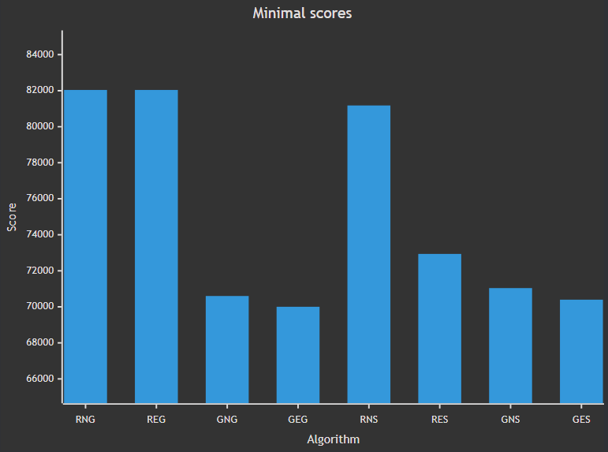
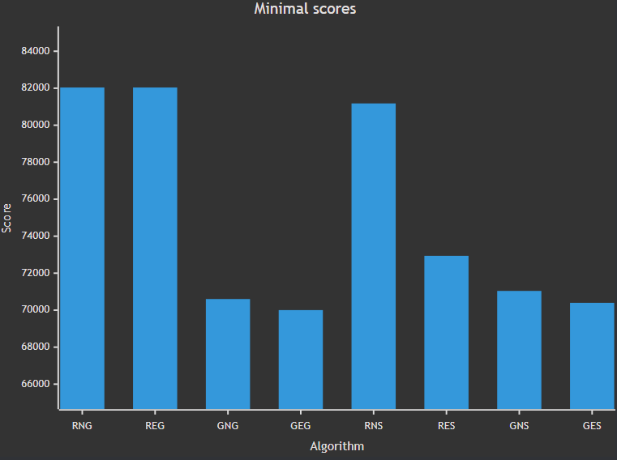
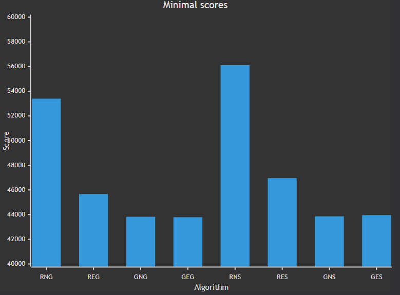
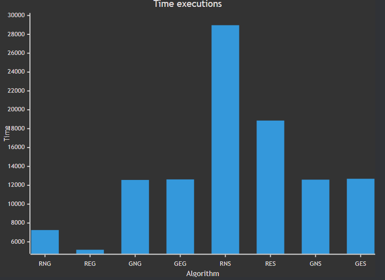

# Assignment 3 - Local Search 

## Authors 
- Michał Kamiński 151969
- Jan Indrzejczak 152059


# Desciption of the problem

The travelling salesman problem (TSP) is a classic optimization problem. Given a list of cities and the distances between them, the task is to find the shortest possible route that visits each city exactly once and returns to the origin city. In this version of the problem, each city also has a cost of being visited, and we only need to select half of the cities.

As an input we received a list of coordinates of cities, along with the cost. To calculate the distance between cities we used Euclidean distance, and each city is represented as a number from 0 to n-1 (n-number of cities). The objective function is to find the route that minimizes the sum of distances between cities and the cost of visiting them.

# Pseudocode of all implemented algorithms

## Greedy starting solution
```
Set Starting Node:

    If start_from is provided, use it as the starting node.
    Otherwise:
        Determine the size of the CostMatrix.
        Generate a random starting node within the range [0, size).

Generate Solutions Using Different Heuristics (continued):

    Using GreedyWeighted2Regret Algorithm:
        Generate a solution starting from start_node.
        Evaluate the score of this solution.
    Using NearestNeighborAnyAlgorithm:
        Generate a solution starting from start_node.
        Evaluate the score of this solution.

Select the Best Solution:

    Compare scores of the three solutions generated.
    Choose the solution with the lowest score.

Return Best Solution
```

## Random starting solution

```
Determine Solution Size:

    Get the total number of nodes, size, from CostMatrix.
    Calculate solution_size as half of size, rounding up if necessary.

Generate Random Node Selection:

    Create a vector nodes containing integers from 0 to solution_size - 1 (representing nodes).
    Shuffle the nodes vector to generate a random order.

Return Random Solution:

    Return nodes as the randomized solution.
```

## Two-edges intra move
```
Evaluate Cost of Two-Edges Exchange:

    Retrieve Nodes and Neighboring Indices:
        Get start_point (node at start index) and target_point (node at target index).
        Get the previous and next neighboring indices for start and target, respectively, using get_neighbouring_indexes.
    Check Edge Overlap:
        If the neighbors of start and target overlap (indicating consecutive edges), return 0 (no change).
    Calculate Cost Delta:
        Calculate the new cost:
            Add the cost of connecting the previous node of start to target_point.
            Add the cost of connecting start_point to the next node of target.
        Subtract the old cost:
            Subtract the cost of connecting the previous node of start to start_point.
            Subtract the cost of connecting target_point to the next node of target.
        Return the cost delta.

Apply Two-Edges Exchange:

    Initialize Segment to Reverse:
        Create new_order, a vector to store nodes in the segment from start to target in reverse order.
    Reverse Segment:
        Traverse indices from start to target in reverse, appending nodes to new_order.
    Replace Original Segment:
        Overwrite the segment in current_solution from start to target with new_order.
```
## Two-nodes intra move
```
Evaluate Cost of Two-Nodes Exchange:

    Retrieve Nodes and Neighboring Indices:
        Identify start_point and target_point as nodes at indices start and target.
        Determine neighboring indices for start (prev_index_start, next_index_start) and target (prev_index_target, next_index_target) using get_neighbouring_indexes.
    Calculate Cost Delta Based on Node Positions:
        If start and target are Consecutive:
            Calculate the new cost:
                Add the cost of connecting prev_index_start to target_point.
                Add the cost of connecting start_point to next_index_target.
            Subtract the old cost:
                Subtract the cost of connecting prev_index_start to start_point.
                Subtract the cost of connecting target_point to next_index_target.
        If start is the First Node and target is the Last Node:
            Calculate the new cost:
                Add the cost of connecting prev_index_target to start_point.
                Add the cost of connecting target_point to next_index_start.
            Subtract the old cost:
                Subtract the cost of connecting prev_index_target to target_point.
                Subtract the cost of connecting start_point to next_index_start.
        Otherwise:
            Calculate the new cost:
                Add the cost of connecting prev_index_start to target_point.
                Add the cost of connecting target_point to next_index_start.
                Add the cost of connecting prev_index_target to start_point.
                Add the cost of connecting start_point to next_index_target.
            Subtract the old cost:
                Subtract the cost of connecting prev_index_start to start_point.
                Subtract the cost of connecting start_point to next_index_start.
                Subtract the cost of connecting prev_index_target to target_point.
                Subtract the cost of connecting target_point to next_index_target.
    Return the cost delta.

Apply Two-Nodes Exchange:

    Swap Nodes at start and target:
        Store the value of current_solution[start] in a temporary variable.
        Replace current_solution[start] with current_solution[target].
        Replace current_solution[target] with the temporary variable.
```

## Greedy local search
```
Initialize Solution and Free Nodes:

    Set current_solution as the starting_solution.
    Create free_nodes: Nodes not in the current_solution, for inter-route moves.
    Define Solution Parameters:
        solution_size as the length of current_solution.
        free_nodes_size as the length of free_nodes.

Greedy Local Search Loop:

    Repeat Until No Better Move Found:
        Initialize found_better as False.
        Create Neighborhood Iterator: Initialize an iterator to cycle through available moves.
    Randomized Neighborhood Search Loop:
        Retrieve Next Move from the iterator:
            If there are no further moves, exit the inner loop.
            Otherwise, assign the move to next_move.
        Evaluate Move:
             Calculate the change in the objective function for next_move, considering current_solution and free_nodes.
        Apply Greedy Move if Improvement Found:
            If change < 0: Move improves solution.
                Apply next_move, updating current_solution and free_nodes.
                Set found_better to True and break out of the inner loop to check for further improvements.

Terminate When No Improvement Found:

    If found_better remains False, break from the outer loop to finish.

Return Optimized Solution:

    Output current_solution after local search has finished.
```

## Steepest local search
```
Initialize Solution and Free Nodes:

    Set current_solution as the starting_solution.
    Create free_nodes: Nodes not in the current_solution, for inter-route moves.
    Define Solution Parameters:
        solution_size as the length of current_solution.
        free_nodes_size as the length of free_nodes.

Steepest Local Search Loop:

    Repeat Until No Improvement Move is Found:
        Initialize Neighborhood Iterator: Create an iterator to evaluate all moves in the neighborhood.
        Reset Best Change Tracking:
            Set best_change to 0.
            Initialize best_move as None.

    Evaluate Entire Neighborhood Loop:
        Retrieve Next Move from the iterator:
            If no further moves are available, exit the inner loop.
            Otherwise, assign the move to next_move.
        Evaluate Move:
            Calculate change in the objective function for next_move, considering current_solution and free_nodes.
        Update Best Move if Improvement Found:
            If change < best_change: Found a move with better improvement.
                Set best_change to change and assign next_move to best_move.

    Apply Best Move if Found:
        If best_move is not None, apply it to update current_solution and free_nodes.
        Else, if no improving moves are found, terminate the outer loop.

Return Optimized Solution:

    Output current_solution after steepest local search has finished.
```
# Results of computational experiments 
## TSPA

```
Results for Random Start Two Nodes Intra Greedy Local Search
Min cost: 82039
Max cost: 95867
Average cost: 86727

Time took for 200 runs: 1.52690760s, time per run: 7634μs

Best solution:
[86, 70, 65, 115, 46, 198, 139, 5, 42, 59, 118, 72, 151, 162, 133, 100, 26, 152, 2, 120, 44, 129, 57, 55, 49, 102, 62, 9, 15, 114, 186, 148, 124, 94, 121, 53, 158, 154, 180, 63, 122, 167, 92, 31, 113, 175, 171, 16, 78, 145, 52, 14, 144, 21, 7, 164, 27, 90, 165, 40, 185, 106, 178, 3, 23, 0, 143, 183, 89, 137, 176, 79, 135, 127, 123, 149, 131, 47, 116, 43, 184, 177, 54, 160, 34, 41, 193, 159, 146, 22, 18, 108, 68, 51, 80, 189, 97, 1, 101, 75]

Results for Random Start Two Edges Intra Greedy Local Search
Min cost: 82039
Max cost: 77907
Average cost: 74035

Time took for 200 runs: 1.08737120s, time per run: 5436μs

Best solution:
[18, 69, 108, 117, 0, 143, 183, 89, 23, 186, 15, 9, 62, 144, 14, 165, 185, 40, 90, 81, 196, 56, 113, 175, 171, 16, 31, 145, 78, 25, 44, 120, 129, 92, 57, 55, 52, 106, 178, 49, 102, 148, 137, 176, 80, 79, 63, 94, 124, 152, 2, 1, 97, 101, 75, 86, 26, 100, 121, 53, 158, 180, 154, 135, 70, 127, 123, 112, 184, 190, 10, 177, 54, 48, 160, 34, 181, 42, 5, 43, 116, 47, 65, 131, 149, 162, 133, 151, 51, 109, 118, 59, 115, 46, 139, 41, 193, 159, 146, 22]

Results for Greedy Start Two Nodes Intra Greedy Local Search
Min cost: 70602
Max cost: 72778
Average cost: 71599

Time took for 200 runs: 2.62457060s, time per run: 13122μs

Best solution:
[23, 137, 176, 80, 79, 63, 94, 124, 152, 97, 1, 101, 2, 120, 82, 129, 92, 57, 55, 52, 49, 102, 148, 9, 62, 144, 14, 3, 178, 106, 185, 40, 165, 90, 81, 196, 179, 145, 78, 31, 56, 113, 175, 171, 16, 25, 44, 75, 86, 26, 100, 121, 53, 180, 154, 135, 70, 127, 123, 162, 133, 151, 51, 118, 59, 65, 116, 43, 184, 84, 112, 4, 10, 177, 54, 48, 160, 34, 146, 22, 18, 108, 69, 159, 181, 42, 5, 41, 193, 139, 115, 46, 68, 140, 93, 117, 0, 143, 183, 89]

Results for Greedy Start Two Edges Intra Greedy Local Search
Min cost: 70004
Max cost: 72452
Average cost: 71335

Time took for 200 runs: 2.76723930s, time per run: 13836μs

Best solution:
[93, 117, 0, 143, 183, 89, 186, 23, 137, 176, 80, 79, 63, 94, 124, 152, 97, 1, 101, 2, 129, 92, 57, 55, 52, 49, 102, 148, 9, 62, 144, 14, 178, 106, 185, 40, 119, 165, 90, 81, 196, 179, 145, 78, 31, 56, 113, 175, 171, 16, 25, 44, 120, 75, 86, 26, 100, 53, 180, 154, 135, 70, 127, 123, 162, 133, 151, 51, 118, 59, 65, 116, 43, 184, 35, 84, 112, 4, 190, 10, 177, 54, 48, 160, 34, 146, 22, 18, 108, 69, 159, 181, 42, 5, 41, 193, 139, 115, 46, 68]

Results for Random Start Two Nodes Intra Steepest Local Search
Min cost: 81178
Max cost: 98102
Average cost: 88618

Time took for 200 runs: 5.42541400s, time per run: 27127μs

Best solution:
[100, 26, 97, 2, 129, 92, 145, 78, 31, 56, 113, 25, 75, 86, 101, 1, 152, 178, 3, 106, 55, 52, 57, 53, 180, 154, 135, 70, 127, 149, 131, 43, 42, 159, 41, 193, 139, 68, 140, 108, 18, 22, 54, 177, 184, 65, 116, 115, 46, 117, 0, 143, 183, 59, 35, 4, 84, 112, 123, 162, 151, 133, 79, 63, 120, 44, 16, 171, 175, 196, 81, 185, 40, 165, 90, 164, 21, 144, 14, 49, 9, 62, 15, 186, 23, 89, 137, 176, 51, 118, 181, 34, 48, 160, 80, 94, 148, 124, 189, 121]

Results for Random Start Two Edges Intra Steepest Local Search
Min cost: 72938
Max cost: 80126
Average cost: 75326

Time took for 200 runs: 3.64290280s, time per run: 18214μs

Best solution:
[48, 160, 34, 22, 18, 159, 193, 41, 42, 43, 5, 115, 139, 68, 46, 117, 143, 0, 183, 89, 186, 23, 137, 176, 80, 79, 63, 94, 97, 1, 152, 2, 129, 92, 145, 78, 179, 57, 55, 52, 167, 148, 15, 62, 9, 144, 102, 14, 49, 178, 3, 106, 185, 119, 40, 165, 27, 90, 81, 196, 157, 31, 113, 56, 171, 175, 16, 25, 44, 120, 75, 101, 86, 100, 26, 53, 180, 154, 135, 70, 162, 133, 151, 51, 109, 59, 118, 116, 47, 65, 149, 131, 123, 112, 4, 84, 184, 177, 10, 54]

Results for Greedy Start Two Nodes Intra Steepest Local Search
Min cost: 71041
Max cost: 73353
Average cost: 71936

Time took for 200 runs: 2.47011060s, time per run: 12350μs

Best solution:
[137, 176, 80, 79, 63, 94, 124, 152, 97, 1, 101, 2, 120, 82, 129, 57, 92, 55, 52, 49, 102, 148, 9, 62, 144, 14, 3, 178, 106, 185, 165, 40, 90, 81, 196, 179, 145, 78, 31, 56, 113, 175, 171, 16, 25, 44, 75, 86, 26, 100, 121, 53, 180, 154, 135, 70, 127, 123, 162, 133, 151, 51, 118, 59, 65, 116, 43, 184, 84, 112, 4, 190, 10, 177, 54, 48, 160, 34, 146, 22, 18, 108, 69, 159, 181, 42, 5, 193, 41, 115, 139, 68, 46, 0, 117, 143, 183, 89, 186, 23]

Results for Greedy Start Two Edges Intra Steepest Local Search
Min cost: 70397
Max cost: 72984
Average cost: 71677

Time took for 200 runs: 2.49963340s, time per run: 12498μs

Best solution:
[68, 46, 115, 139, 193, 41, 5, 42, 181, 159, 69, 108, 18, 22, 146, 34, 160, 48, 54, 177, 10, 190, 4, 112, 84, 35, 184, 43, 116, 65, 59, 118, 51, 151, 133, 162, 123, 127, 70, 135, 180, 154, 53, 100, 26, 86, 75, 120, 44, 25, 16, 171, 175, 113, 56, 31, 78, 145, 179, 185, 119, 40, 196, 81, 90, 165, 14, 144, 62, 9, 148, 102, 49, 178, 106, 55, 52, 57, 92, 129, 2, 101, 1, 97, 152, 124, 94, 63, 79, 80, 176, 137, 23, 186, 89, 183, 143, 0, 117, 93]
```




## TSPB

```

Results for Random Start Two Nodes Intra Greedy Local Search
Min cost: 53396
Max cost: 67230
Average cost: 61477

Time took for 200 runs: 1.45080690s, time per run: 7254μs

Best solution:
[28, 20, 148, 47, 94, 179, 185, 86, 166, 194, 113, 26, 89, 127, 137, 114, 88, 176, 180, 153, 81, 82, 91, 61, 21, 87, 104, 182, 118, 51, 191, 90, 122, 63, 135, 1, 117, 54, 31, 193, 190, 80, 175, 36, 141, 97, 77, 111, 139, 134, 147, 6, 188, 169, 132, 13, 126, 195, 168, 11, 160, 33, 138, 25, 121, 73, 136, 5, 177, 8, 144, 29, 145, 15, 70, 3, 189, 155, 184, 152, 183, 130, 95, 128, 124, 106, 103, 163, 159, 143, 35, 0, 109, 34, 55, 18, 62, 83, 140, 149]      

Results for Random Start Two Edges Intra Greedy Local Search
Min cost: 45665
Max cost: 51760
Average cost: 48390

Time took for 200 runs: 1.03336490s, time per run: 5166μs

Best solution:
[28, 149, 140, 183, 152, 34, 55, 18, 83, 62, 128, 124, 106, 143, 35, 109, 0, 29, 160, 144, 111, 82, 8, 104, 33, 11, 168, 195, 145, 3, 70, 132, 169, 188, 6, 147, 71, 51, 121, 131, 90, 10, 133, 122, 135, 100, 107, 40, 63, 38, 1, 156, 198, 117, 193, 31, 54, 164, 73, 136, 190, 80, 175, 78, 5, 177, 21, 61, 36, 91, 141, 77, 81, 153, 146, 187, 163, 103, 89, 127, 137, 114, 113, 180, 176, 194, 166, 86, 185, 95, 130, 99, 22, 179, 66, 94, 47, 148, 60, 20]        

Results for Greedy Start Two Nodes Intra Greedy Local Search
Min cost: 43826
Max cost: 51911
Average cost: 45331

Time took for 200 runs: 2.51331760s, time per run: 12566μs

Best solution:
[121, 51, 90, 191, 147, 6, 188, 169, 132, 13, 70, 3, 15, 145, 195, 168, 139, 11, 138, 33, 160, 29, 0, 109, 35, 143, 106, 124, 62, 18, 55, 34, 170, 152, 183, 140, 4, 149, 28, 20, 60, 148, 47, 94, 66, 179, 185, 22, 99, 130, 95, 86, 166, 194, 176, 113, 103, 127, 89, 163, 187, 153, 81, 77, 141, 91, 36, 61, 21, 82, 111, 8, 104, 177, 5, 45, 142, 78, 175, 162, 80, 190, 136, 73, 54, 31, 193, 117, 198, 156, 1, 16, 27, 38, 135, 63, 40, 107, 122, 131]

Results for Greedy Start Two Edges Intra Greedy Local Search
Min cost: 43790
Max cost: 50892
Average cost: 44898

Time took for 200 runs: 2.52468280s, time per run: 12623μs

Best solution:
[40, 107, 122, 135, 131, 121, 51, 90, 191, 147, 6, 188, 169, 132, 13, 70, 3, 15, 145, 195, 168, 139, 11, 138, 33, 160, 29, 0, 109, 35, 143, 106, 124, 62, 18, 55, 34, 170, 152, 183, 140, 4, 149, 28, 20, 60, 148, 47, 94, 66, 179, 185, 22, 99, 130, 95, 86, 166, 194, 176, 113, 103, 127, 89, 163, 187, 153, 81, 77, 141, 91, 36, 61, 21, 82, 111, 8, 104, 177, 5, 45, 142, 78, 175, 162, 80, 190, 136, 73, 54, 31, 193, 117, 198, 156, 1, 16, 27, 38, 63]

Results for Random Start Two Nodes Intra Steepest Local Search
Min cost: 56112
Max cost: 73195
Average cost: 63387

Time took for 200 runs: 5.79348240s, time per run: 28967μs

Best solution:
[133, 40, 107, 63, 135, 32, 122, 90, 51, 43, 145, 13, 132, 169, 134, 54, 31, 117, 1, 38, 27, 131, 121, 182, 138, 139, 168, 195, 11, 160, 33, 104, 21, 141, 61, 36, 177, 5, 78, 175, 80, 190, 193, 73, 25, 20, 60, 47, 94, 66, 148, 28, 149, 140, 18, 62, 95, 99, 179, 166, 194, 176, 113, 103, 89, 127, 163, 187, 153, 77, 82, 8, 111, 55, 34, 170, 184, 155, 3, 70, 15, 29, 109, 0, 35, 143, 159, 119, 124, 106, 128, 86, 185, 130, 183, 152, 189, 188, 6, 147]        

Results for Random Start Two Edges Intra Steepest Local Search
Min cost: 46957
Max cost: 52832
Average cost: 49725

Time took for 200 runs: 3.77209220s, time per run: 18860μs

Best solution:
[81, 77, 97, 141, 91, 79, 36, 61, 177, 5, 142, 78, 175, 80, 190, 193, 73, 164, 54, 31, 117, 198, 156, 1, 27, 16, 38, 135, 102, 63, 107, 40, 10, 133, 122, 90, 121, 51, 147, 134, 6, 188, 169, 132, 70, 15, 3, 145, 195, 13, 168, 11, 139, 138, 33, 160, 144, 104, 8, 21, 87, 82, 111, 29, 12, 109, 0, 35, 124, 106, 62, 55, 18, 34, 183, 140, 4, 28, 149, 20, 60, 148, 47, 66, 94, 179, 185, 22, 99, 130, 95, 86, 166, 194, 176, 113, 103, 89, 163, 153]

Results for Greedy Start Two Nodes Intra Steepest Local Search
Min cost: 43862
Max cost: 51147
Average cost: 45355

Time took for 200 runs: 2.51956070s, time per run: 12597μs

Best solution:
[131, 122, 40, 107, 63, 135, 38, 27, 16, 1, 156, 198, 117, 193, 31, 54, 73, 136, 190, 80, 162, 175, 78, 142, 45, 5, 177, 104, 8, 111, 82, 21, 61, 36, 91, 141, 77, 81, 153, 187, 163, 89, 127, 103, 113, 176, 194, 166, 86, 95, 130, 99, 22, 185, 179, 66, 94, 47, 148, 60, 20, 28, 149, 4, 140, 183, 152, 170, 34, 55, 18, 62, 124, 106, 143, 35, 109, 0, 29, 160, 33, 138, 11, 139, 168, 195, 145, 15, 3, 70, 13, 132, 169, 188, 6, 147, 191, 90, 51, 121]

Results for Greedy Start Two Edges Intra Steepest Local Search
Min cost: 43958
Max cost: 50901
Average cost: 45008

Time took for 200 runs: 2.53801320s, time per run: 12690μs

Best solution:
[63, 38, 27, 16, 1, 156, 198, 117, 193, 31, 54, 73, 136, 190, 80, 162, 175, 78, 142, 45, 5, 177, 36, 61, 91, 141, 77, 81, 153, 187, 163, 89, 127, 137, 114, 103, 113, 180, 176, 194, 166, 86, 95, 130, 99, 22, 185, 179, 66, 94, 47, 148, 60, 20, 28, 149, 4, 140, 183, 152, 170, 34, 55, 18, 62, 124, 106, 143, 35, 109, 0, 29, 160, 33, 138, 182, 11, 139, 168, 195, 145, 15, 3, 70, 13, 132, 169, 188, 6, 147, 191, 90, 51, 121, 131, 135, 122, 133, 107, 40]        
```



# Table of the results
|                                       | TSPA                 | TSPB                |
|---------------------------------------|----------------------|---------------------|
| Random Start Two Nodes Intra Greedy   | 86727 (82039-95867)  | 61477 (53396-67230) |
| Random Start Two Edges Intra Greedy   | 74035  (77907-82039) | 48390 (45665-51760) |
| Greedy Start Two Nodes Intra Greedy   | 71599  (70602-72778) | 45331 (43826-51911) |
| Greedy Start Two Edges Intra Greedy   | 71335  (70004-72452) | 44898 (43790-50892) |
| Random Start Two Nodes Intra Steepest | 88618  (81178-98102) | 63387 (56112-73195) |
| Random Start Two Edges Intra Steepest | 75326  (72938-80126) | 49725 (46957-52832) |
| Greedy Start Two Nodes Intra Steepest | 71936  (71041-73353) | 45355 (43862-51147) |
| Greedy Start Two Edges Intra Steepest | 71677  (70397-72984) | 45008 (43958-50901) |

# Table of execution times in microseconds (μs)
|                                       | TSPA  | TSPB  |
|---------------------------------------|-------|-------|
| Random Start Two Nodes Intra Greedy   | 7634  | 7254  |
| Random Start Two Edges Intra Greedy   | 5436  | 5166  |
| Greedy Start Two Nodes Intra Greedy   | 13122 | 12566 |
| Greedy Start Two Edges Intra Greedy   | 13836 | 12623 |
| Random Start Two Nodes Intra Steepest | 27127 | 28967 |
| Random Start Two Edges Intra Steepest | 18214 | 18860 |
| Greedy Start Two Nodes Intra Steepest | 12350 | 12597 |
| Greedy Start Two Edges Intra Steepest | 12498 | 12690 |


# Plots of the results

## TSPA


## TSPB


# Source code

- [Github repository](https://github.com/2002jan/put-ec-2024)


# Conclusions

One key observation is that two-edge exchange neighborhood performs as good as or better than two-nodes exchange. 
What is more, starting the algorithm with a greedy solution yields better results than using a random one. 
The difference between steepest and greedy versions of local search are not unambiguous. In some cases, one 
outperforms the other and vice versa. It is hard to conclude anything from execution times, as it will depend on the 
starting solution. A lot of factors amount to the final execution.
