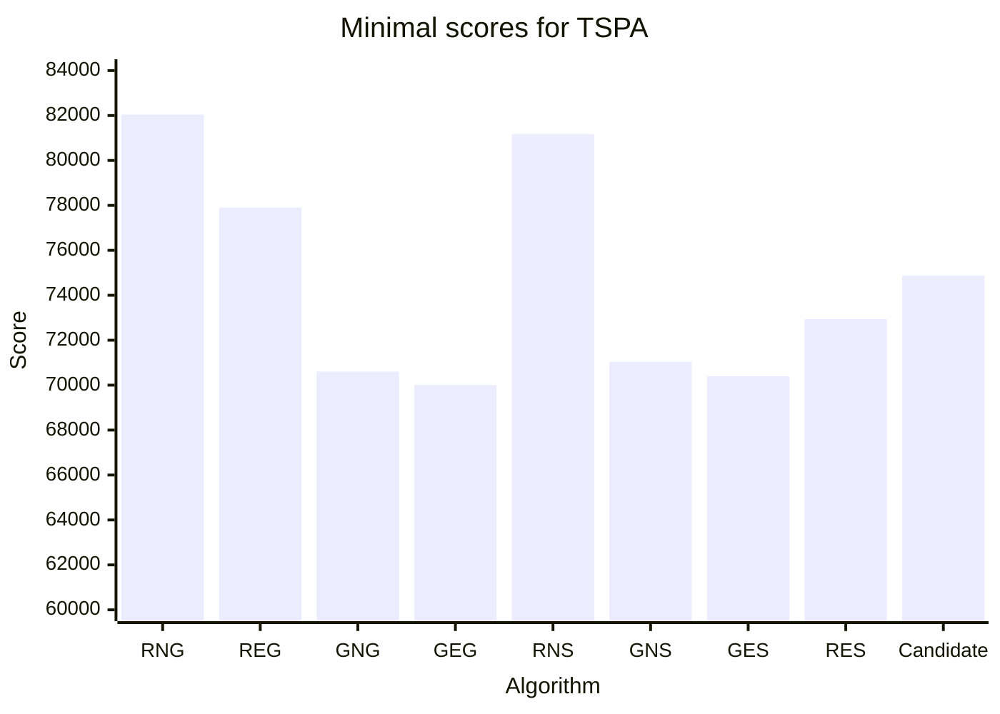
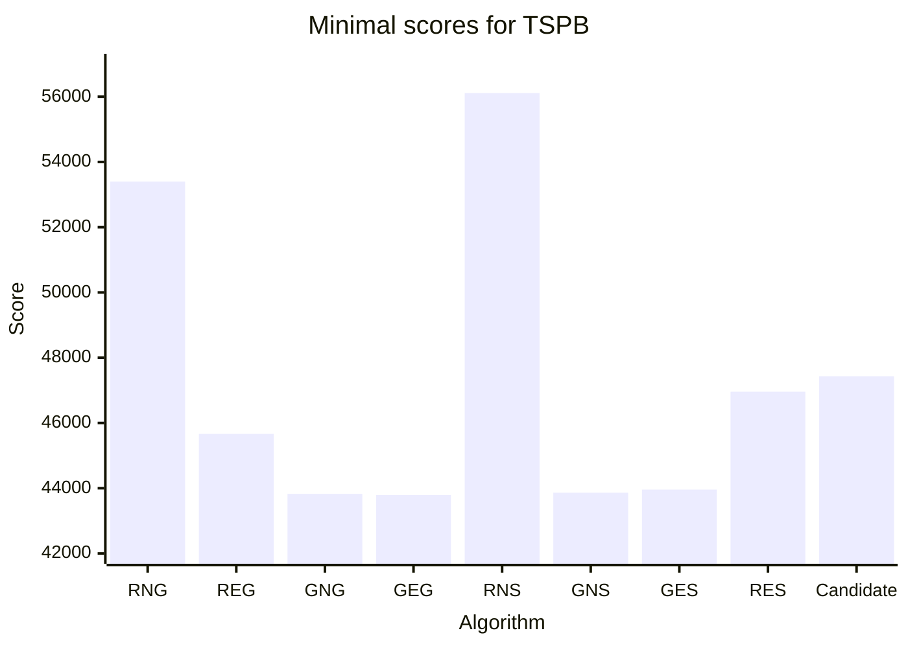
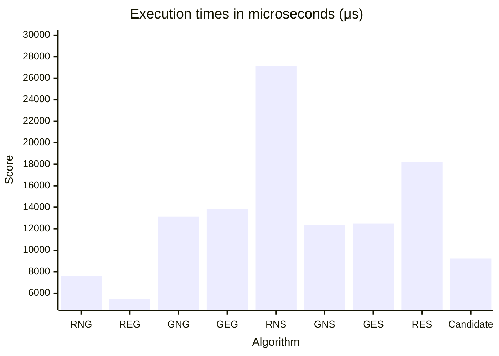
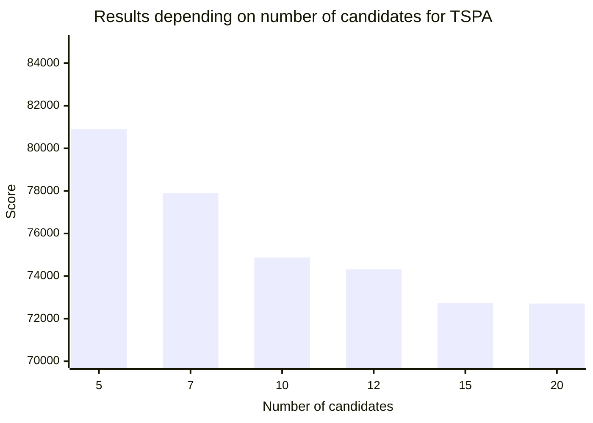
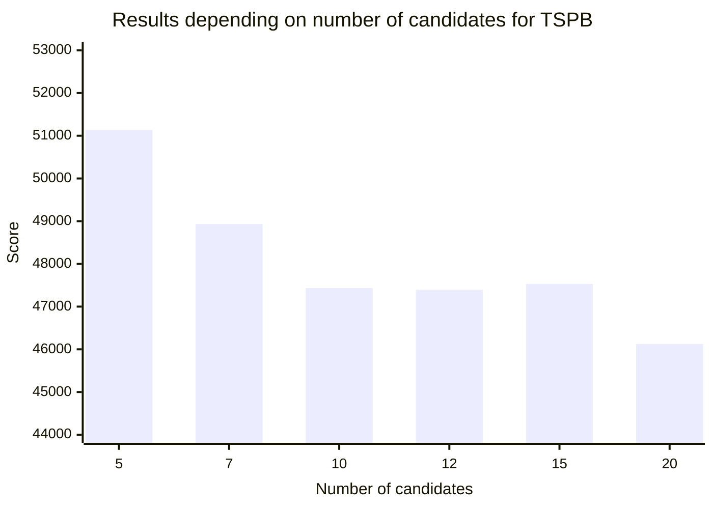

# Assignment 4 - The use of candidate moves in local search


## Authors
- Michał Kamiński 151969
- Jan Indrzejczak 152059


# Desciption of the problem

The travelling salesman problem (TSP) is a classic optimization problem. Given a list of cities and the distances between them, the task is to find the shortest possible route that visits each city exactly once and returns to the origin city. In this version of the problem, each city also has a cost of being visited, and we only need to select half of the cities.

As an input we received a list of coordinates of cities, along with the cost. To calculate the distance between cities we used Euclidean distance, and each city is represented as a number from 0 to n-1 (n-number of cities). The objective function is to find the route that minimizes the sum of distances between cities and the cost of visiting them.

# Pseudocode of all implemented algorithms

## Random starting solution

```
Determine Solution Size:

    Get the total number of nodes, size, from CostMatrix.
    Calculate solution_size as half of size, rounding up if necessary.

Generate Random Node Selection:

    Create a vector nodes containing integers from 0 to solution_size - 1 (representing nodes).
    Shuffle the nodes vector to generate a random order.

Return Random Solution:

    Return nodes as the randomized solution.
```

## Steepest local search with the use of candidate moves

# Table of the results

<style>
    .heatMap tr:nth-last-child(-n+2) {
        background-color: rgb(204, 204, 204); 
    }
</style>

<div class="heatMap">

|                                                 | TSPA                | TSPB                |
|-------------------------------------------------|---------------------|---------------------|
| Random Start Two Nodes Intra Greedy             | 86727 (82039-95867) | 61477 (53396-67230) |
| Random Start Two Edges Intra Greedy             | 74035 (77907-82039) | 48390 (45665-51760) |
| Greedy Start Two Nodes Intra Greedy             | 71599 (70602-72778) | 45331 (43826-51911) |
| Greedy Start Two Edges Intra Greedy             | 71335 (70004-72452) | 44898 (43790-50892) |
| Random Start Two Nodes Intra Steepest           | 88618 (81178-98102) | 63387 (56112-73195) |
| Greedy Start Two Nodes Intra Steepest           | 71936 (71041-73353) | 45355 (43862-51147) |
| Greedy Start Two Edges Intra Steepest           | 71677 (70397-72984) | 45008 (43958-50901) |
| Random Start Two Edges Intra Steepest           | 75326 (72938-80126) | 49725 (46957-52832) |
| Random Start Two Edges Intra Steepest Candidate | 79763 (74876-84144) | 51500 (47433-58226) |

</div>






## Results of previous algorithms

| Algorithm                                        | TSPA                        | TSPB                       |
|--------------------------------------------------|-----------------------------|----------------------------|
| Random Algorithm                                 | 225467                      | 193417                     |
| Nearest Neighbor (Add at End)                    | 83182                       | 52319                      |
| Nearest Neighbor (Insert Anywhere)               | 71179                       | 44417                      |
| Greedy Cycle                                     | 72636 (71488-74410)         | 51401 (49001-57324)        |
| Greedy Regret Heuristic with 2-Regret            | 116681 (108804-123447)      | 70265 (65043-76325)        |
| Greedy Regret Heuristic with Weighted 2-Regret   | 72148 (71108-73718)         | 50997 (47144-56747)        |
| Random Start Two Edges Intra Steepest Candidate  | 79763 (74876-84144)         | 51500 (47433-58226)        |
| Random Start Two Edges Intra Steepest            | 75172 (72784-80372)         | 49635 (47325-52654)        |


# Table of execution times in microseconds (μs)

| Algorithm                                       | TSPA  | TSPB  |
|-------------------------------------------------|-------|-------|
| Random Start Two Nodes Intra Greedy             | 7634  | 7254  |
| Random Start Two Edges Intra Greedy             | 5436  | 5166  |
| Greedy Start Two Nodes Intra Greedy             | 13122 | 12566 |
| Greedy Start Two Edges Intra Greedy             | 13836 | 12623 |
| Random Start Two Nodes Intra Steepest           | 27127 | 28967 |
| Greedy Start Two Nodes Intra Steepest           | 12350 | 12597 |
| Greedy Start Two Edges Intra Steepest           | 12498 | 12690 |
| Random Start Two Edges Intra Steepest           | 18214 | 18860 |
| Random Start Two Edges Intra Steepest Candidate | 9225  | 9826  |




## Results of Steepest local search with various candidate numbers

| Candidate number | TSPA                | time (μs) | TSPB                | time  (μs) |
|------------------|---------------------|-----------|---------------------|------------|
| 5                | 86393 (80902-92383) | 5097      | 55014 (51131-62204) | 5215       |
| 7                | 83236 (77893-88701) | 6884      | 52948 (48933-59145) | 7407       |
| 10               | 79763 (74876-84144) | 10118     | 51500 (47433-58226) | 9826       |
| 12               | 78332 (74322-83204) | 10656     | 50771 (47393-55307) | 11605      |
| 15               | 77352 (72737-83065) | 12341     | 50184 (47530-54007) | 13675      |
| 20               | 75334 (72712-78897) | 16719     | 49695 (46125-53846) | 16775      |
| 25               | 74471 (71867-79526) | 19913     | 49393 (46085-53298) | 20595      |





# Raw results
## TSPA

```
Results for Random Start Two Edges Intra Steepest Candidate Local Search
Min cost: 74876
Max cost: 84144
Average cost: 79763

Time took for 200 runs: 2.02374600s, time per run: 10118μs

Best solution:
[27, 164, 95, 165, 8, 3, 178, 106, 52, 55, 92, 57, 129, 2, 152, 94, 148, 37, 49, 32, 14, 144, 62, 9, 15, 137, 23, 89, 183, 143, 0, 117, 93, 108, 18, 22, 159, 193, 41, 139, 68, 46, 115, 116, 65, 47, 77, 43, 42, 181, 160, 34, 48, 54, 30, 177, 10, 184, 35, 4, 84, 112, 123, 127, 70, 135, 154, 180, 133, 162, 151, 72, 59, 51, 176, 80, 79, 63, 53, 86, 101, 26, 97, 1, 75, 120, 82, 44, 16, 171, 175, 113, 56, 31, 78, 145, 185, 40, 81, 90]

Results for Random Start Two Edges Intra Steepest Local Search
Min cost: 72784
Max cost: 80372
Average cost: 75172

Time took for 200 runs: 3.74329240s, time per run: 18716μs

Best solution:
[184, 43, 149, 65, 116, 115, 59, 118, 51, 80, 176, 124, 94, 63, 122, 79, 133, 151, 162, 123, 127, 70, 135, 154, 180, 53, 86, 26, 100, 121, 189, 152, 97, 1, 101, 75, 2, 120, 25, 44, 82, 129, 57, 92, 145, 78, 171, 16, 175, 113, 31, 81, 196, 90, 165, 40, 119, 185, 52, 55, 106, 178, 14, 144, 49, 102, 9, 62, 37, 148, 15, 186, 137, 23, 89, 183, 0, 143, 117, 46, 68, 139, 69, 108, 18, 22, 159, 193, 41, 5, 42, 181, 34, 48, 160, 54, 177, 10, 190, 84]

```

## TSPB

```
Results for Random Start Two Edges Intra Steepest Candidate Local Search
Min cost: 47433
Max cost: 58226
Average cost: 51500

Time took for 200 runs: 1.96530270s, time per run: 9826μs

Best solution:
[89, 127, 114, 113, 176, 194, 166, 86, 185, 22, 179, 94, 47, 148, 60, 20, 28, 149, 4, 140, 183, 95, 106, 124, 62, 83, 18, 55, 34, 152, 155, 3, 70, 188, 169, 13, 145, 195, 168, 109, 35, 0, 29, 49, 33, 160, 8, 104, 138, 11, 139, 43, 134, 147, 51, 121, 90, 122, 133, 10, 40, 107, 100, 63, 102, 135, 131, 38, 27, 16, 1, 156, 198, 117, 193, 31, 54, 73, 136, 190, 80, 175, 78, 45, 5, 177, 21, 36, 61, 79, 91, 141, 77, 82, 111, 41, 81, 153, 163, 103]

Results for Random Start Two Edges Intra Steepest Local Search
Min cost: 47325
Max cost: 52654
Average cost: 49635

Time took for 200 runs: 4.71668580s, time per run: 23583μs

Best solution:
[195, 168, 29, 0, 109, 35, 160, 33, 11, 139, 134, 51, 121, 25, 138, 104, 21, 82, 8, 144, 111, 106, 124, 62, 83, 55, 18, 34, 170, 152, 140, 183, 149, 28, 20, 60, 148, 94, 47, 66, 179, 185, 130, 99, 95, 86, 166, 194, 113, 176, 103, 127, 89, 163, 187, 153, 81, 77, 141, 91, 36, 61, 177, 5, 45, 142, 78, 175, 80, 190, 193, 31, 73, 54, 117, 1, 16, 38, 27, 102, 63, 135, 32, 122, 100, 107, 40, 10, 133, 90, 191, 147, 6, 188, 169, 70, 3, 145, 15, 13]
```

# Plots of the results

## TSPA


## TSPB


# Source code

- [Github repository](https://github.com/2002jan/put-ec-2024)


# Conclusions

As we predicted, the introduction of candidate moves limited the neighbourhood which slightly worsened
the score, however it significantly improved the execution time. It is almost twice as fast as regular Steepest
local search with two edge exchange and random starting solution. It turns out that introducing more candidates
makes the score better, because broaden the search space. However, reaching 25 candidates makes the execution time equal as that of steepest local search.