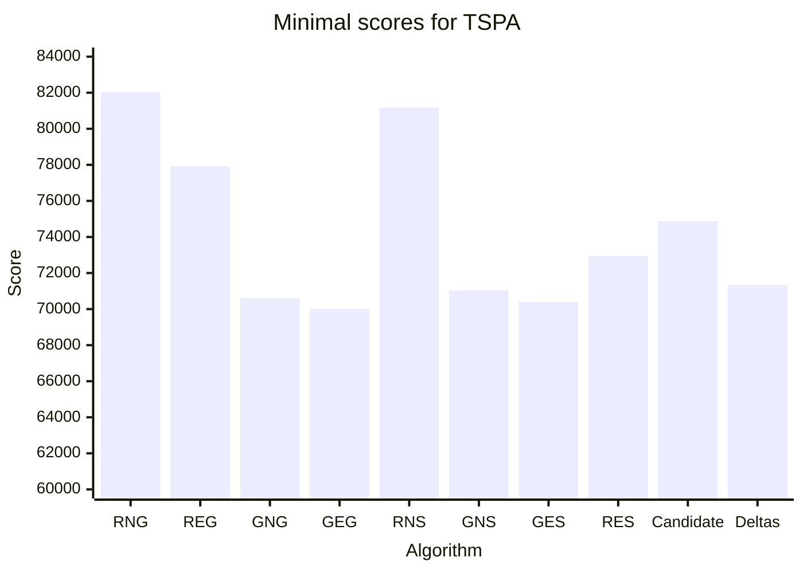
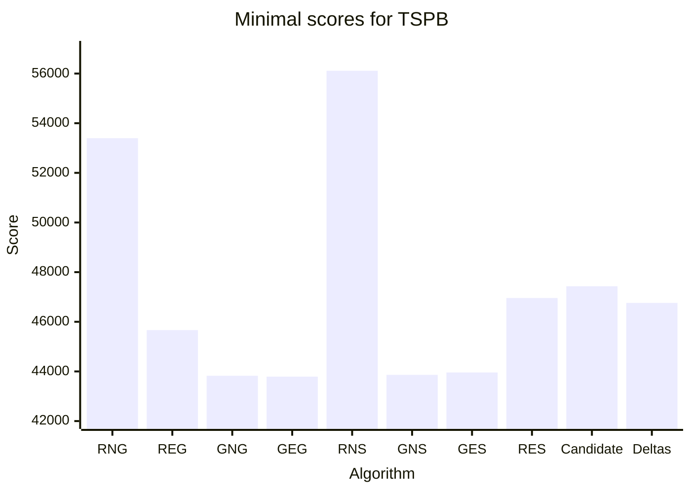
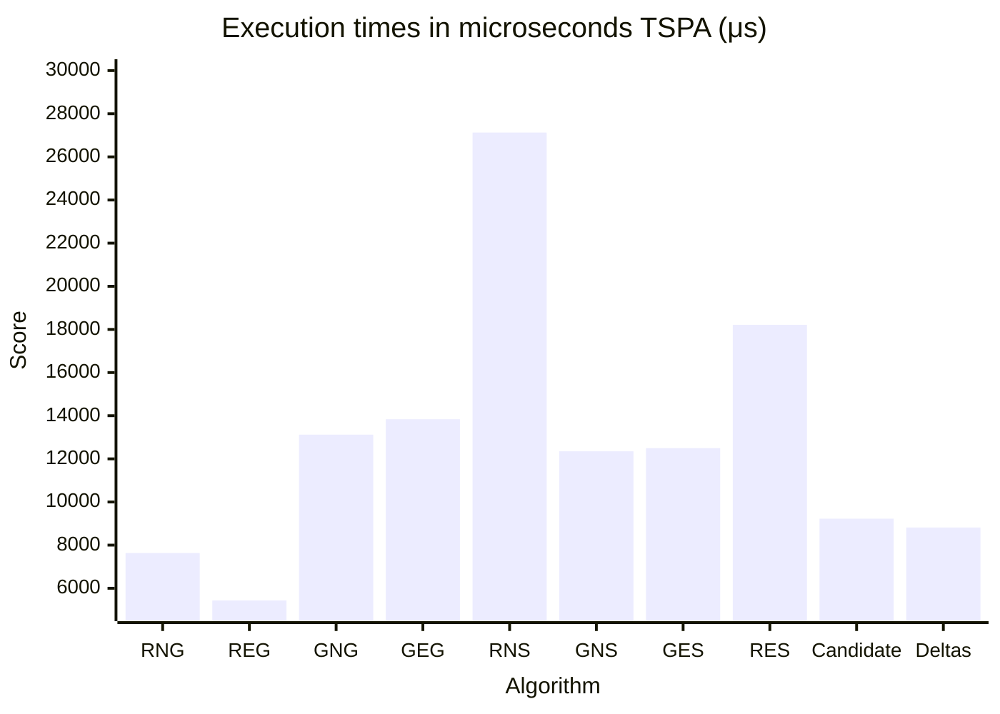

# Assignment 4 - The use of candidate moves in local search


## Authors
- Michał Kamiński 151969
- Jan Indrzejczak 152059


# Desciption of the problem

The travelling salesman problem (TSP) is a classic optimization problem. Given a list of cities and the distances between them, the task is to find the shortest possible route that visits each city exactly once and returns to the origin city. In this version of the problem, each city also has a cost of being visited, and we only need to select half of the cities.

As an input we received a list of coordinates of cities, along with the cost. To calculate the distance between cities we used Euclidean distance, and each city is represented as a number from 0 to n-1 (n-number of cities). The objective function is to find the route that minimizes the sum of distances between cities and the cost of visiting them.

# Pseudocode of all implemented algorithms

## Steepest local search with the use of deltas from previous iterations

```
Input:
    cost_matrix: Cost matrix for evaluating moves.
    points_cost: Additional costs for nodes.
    starting_solution: Initial Hamiltonian cycle.
    Output: Optimized solution minimizing total costs.

Setup:
    Data Structures:
        current_solution: Start with starting_solution.
        free_nodes: Nodes not in current_solution.
        nodes_poses: HashMap to track each node's position and inclusion in the cycle.
        improving_moves: A sorted map (BTreeMap) storing moves by delta values (ImprovingMoveWrapper).
        
Main algorithm

1. Fill improving_moves:
    For each node in current_solution and free_nodes:
    
        Evaluate Intra-Moves.
        Evaluate Inter-Moves.
    
    Add all improving moves (negative delta) to improving_moves.
2. Reverse current solution and recompute step 1 to get all improving moves.
3. Iterate over improving_moves
    initialize moves_to_re_add as a linked list of moves to be skipped.
    while improving_moves is not empty:
        retrieve the best move  
        check if the move is still valid
        
       
Move Validity Checks

    For Each Move in improving_moves:

        If Intra-Move:
            Extract start, start_prev, target, target_next.
            Compute start_pos and target_pos using nodes_poses.
            Evaluate validity:
                Removed Edges Do Not Exist:
                    Remove the move from improving_moves.
                Edges Exist in Different Direction (Partial Reverse):
                    Skip this move (retain in improving_moves for future evaluation).
                Edges Exist in Same Direction (Valid Orientation):
                    Mark as valid.
                Edges are Reversed:
                    Mark as Reverse

        If Inter-Move:
            Extract start, start_prev, start_next, target.
            Compute start_pos and target_pos.
            Evaluate validity:
                Removed Edges Do Not Exist:
                    Remove the move.
                Edges Exist in Valid Orientation:
                    Mark as valid.

    Based on Validity:
        Valid Move:
            Apply the move.
            Remove it from improving_moves.
        Reverse Direction:
            Reverse edges in the move and apply. 
        Skip:
            Retain move in moves_to_re_add for future evaulation (at the end of the iteration place in improving_moves)

4. Apply the move to current_solution and update:
    Swap or reorder nodes as per the move type.
    Update nodes_poses with new positions.

5. Generate new potential moves using get_new_moves:
    Evaluate deltas for the new moves.
    Add all valid, improving moves (negative deltas) to improving_moves.

6. Re-add skipped moves to improving_moves.

Termination

    Repeat until no improving moves remain.
    Return the optimized current_solution.
```

# Table of the results 


| Algorithm                                       | TSPA                | TSPB                |
|-------------------------------------------------|---------------------|---------------------|
| Random Start Two Nodes Intra Greedy             | 86727 (82039-95867) | 61477 (53396-67230) |
| Random Start Two Edges Intra Greedy             | 74035 (77907-82039) | 48390 (45665-51760) |
| Greedy Start Two Nodes Intra Greedy             | 71599 (70602-72778) | 45331 (43826-51911) |
| Greedy Start Two Edges Intra Greedy             | 71335 (70004-72452) | 44898 (43790-50892) |
| Random Start Two Nodes Intra Steepest           | 88618 (81178-98102) | 63387 (56112-73195) |
| Greedy Start Two Nodes Intra Steepest           | 71936 (71041-73353) | 45355 (43862-51147) |
| Greedy Start Two Edges Intra Steepest           | 71677 (70397-72984) | 45008 (43958-50901) |
| Random Start Two Edges Intra Steepest Candidate | 79763 (74876-84144) | 51500 (47433-58226) |
| Random Start Two Edges Intra Steepest           | 75326 (72938-80126) | 49725 (46957-52832) |
| Random Start Two Edges Intra Steepest Deltas    | 74207 (71342-78723) | 49160 (46761-52674) |





## Results of previous algorithms

| Algorithm                                        | TSPA                        | TSPB                       |
|--------------------------------------------------|-----------------------------|----------------------------|
| Random Algorithm                                 | 225467                      | 193417                     |
| Nearest Neighbor (Add at End)                    | 83182                       | 52319                      |
| Nearest Neighbor (Insert Anywhere)               | 71179                       | 44417                      |
| Greedy Cycle                                     | 72636 (71488-74410)         | 51401 (49001-57324)        |
| Greedy Regret Heuristic with 2-Regret            | 116681 (108804-123447)      | 70265 (65043-76325)        |
| Greedy Regret Heuristic with Weighted 2-Regret   | 72148 (71108-73718)         | 50997 (47144-56747)        |
| Random Start Two Edges Intra Steepest Candidate  | 79763 (74876-84144)         | 51500 (47433-58226)        |
| Random Start Two Edges Intra Steepest            | 75172 (72784-80372)         | 49635 (47325-52654)        |


# Table of execution times in microseconds (μs)

| Algorithm                                       | TSPA  | TSPB  |
|-------------------------------------------------|-------|-------|
| Random Start Two Nodes Intra Greedy             | 7634  | 7254  |
| Random Start Two Edges Intra Greedy             | 5436  | 5166  |
| Greedy Start Two Nodes Intra Greedy             | 13122 | 12566 |
| Greedy Start Two Edges Intra Greedy             | 13836 | 12623 |
| Random Start Two Nodes Intra Steepest           | 27127 | 28967 |
| Greedy Start Two Nodes Intra Steepest           | 12350 | 12597 |
| Greedy Start Two Edges Intra Steepest           | 12498 | 12690 |
| Random Start Two Edges Intra Steepest Candidate | 9225  | 9826  |
| Random Start Two Edges Intra Steepest           | 18214 | 18860 |
| Random Start Two Edges Intra Steepest Deltas    | 8818  | 9259  |





# Raw results
## TSPA

```
Results for Random Start Two Edges Intra Steepest Deltas Local Search
Min cost: 71342
Max cost: 78723
Average cost: 74207

Time took for 200 runs: 1.85190880s, time per run: 9259μs

Best solution:
[165, 39, 95, 164, 27, 90, 81, 196, 31, 56, 113, 175, 171, 16, 25, 44, 120, 78, 145, 179, 57, 92, 129, 82, 2, 75, 86, 101, 1, 100, 26, 97, 152, 124, 94, 121, 53, 180, 154, 135, 70, 127, 123, 162, 151, 133, 63, 79, 80, 176, 51, 109, 118, 59, 65, 116, 43, 42, 184, 177, 10, 54, 48, 160, 34, 181, 41, 193, 159, 22, 18, 69, 108, 140, 93, 68, 139, 115, 46, 0, 143, 183, 89, 186, 23, 137, 148, 9, 62, 144, 14, 49, 3, 178, 106, 52, 55, 185, 40, 119]

Results for Random Start Two Edges Intra Steepest Local Search
Min cost: 71241
Max cost: 78566
Average cost: 74032

Time took for 200 runs: 6.01239220s, time per run: 30061μs

Best solution:
[120, 44, 25, 82, 129, 92, 57, 179, 145, 78, 16, 171, 175, 113, 31, 81, 90, 27, 164, 7, 95, 39, 165, 40, 185, 55, 52, 106, 178, 3, 138, 14, 49, 144, 62, 9, 148, 124, 94, 63, 79, 80, 176, 137, 23, 89, 183, 143, 0, 117, 68, 46, 139, 108, 18, 22, 159, 193, 41, 5, 42, 181, 34, 160, 48, 54, 177, 10, 190, 184, 84, 4, 112, 149, 65, 116, 43, 115, 59, 118, 51, 151, 133, 162, 123, 127, 135, 154, 180, 53, 121, 100, 26, 86, 75, 101, 1, 97, 152, 2]


```

## TSPB

```
Results for Random Start Two Edges Intra Steepest Deltas Local Search
Min cost: 46761
Max cost: 52674
Average cost: 49160

Time took for 200 runs: 1.76374850s, time per run: 8818μs

Best solution:
[103, 113, 176, 194, 166, 179, 95, 183, 140, 4, 149, 28, 20, 60, 148, 47, 94, 66, 22, 99, 185, 86, 128, 106, 124, 62, 18, 55, 34, 152, 155, 70, 3, 15, 145, 132, 169, 188, 6, 147, 191, 90, 51, 121, 131, 122, 10, 133, 72, 107, 40, 63, 102, 135, 38, 27, 16, 1, 198, 117, 193, 31, 54, 73, 190, 80, 45, 142, 175, 78, 5, 177, 25, 182, 139, 168, 11, 138, 33, 160, 29, 109, 35, 0, 12, 144, 104, 8, 111, 82, 87, 21, 36, 61, 91, 141, 77, 81, 153, 163]

Results for Random Start Two Edges Intra Steepest Local Search
Min cost: 45873
Max cost: 51625
Average cost: 48628

Time took for 200 runs: 5.58757780s, time per run: 27937μs

Best solution:
[31, 193, 117, 198, 156, 1, 16, 27, 38, 63, 40, 107, 133, 122, 135, 131, 121, 51, 90, 191, 147, 6, 188, 169, 132, 70, 3, 15, 145, 13, 195, 168, 29, 0, 109, 35, 143, 106, 124, 62, 83, 18, 55, 34, 152, 183, 140, 149, 28, 20, 23, 60, 148, 47, 94, 66, 172, 179, 22, 99, 130, 95, 185, 86, 166, 194, 176, 113, 163, 153, 81, 77, 97, 141, 91, 79, 61, 36, 21, 87, 82, 8, 104, 160, 33, 138, 11, 139, 182, 25, 177, 5, 142, 78, 175, 80, 190, 73, 164, 54]

```


# Plots of the results

## TSPA


## TSPB


# Source code

- [Github repository](https://github.com/2002jan/put-ec-2024)


# Conclusions