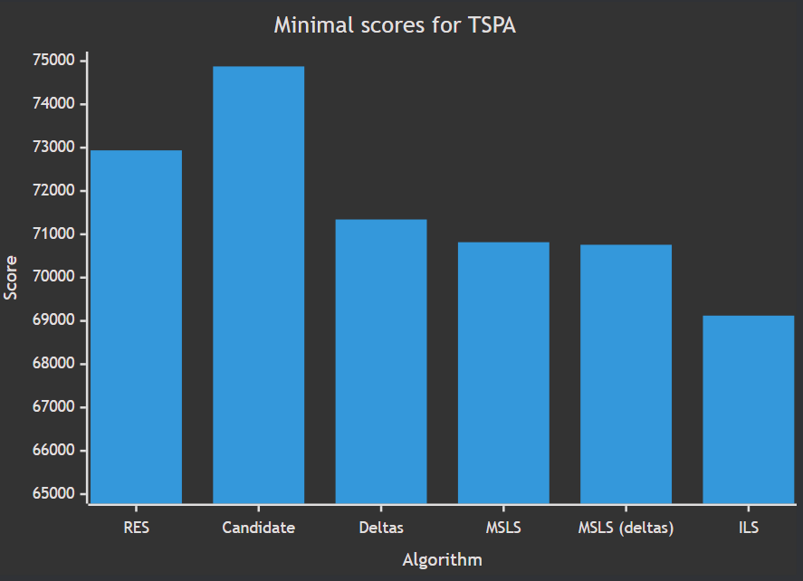
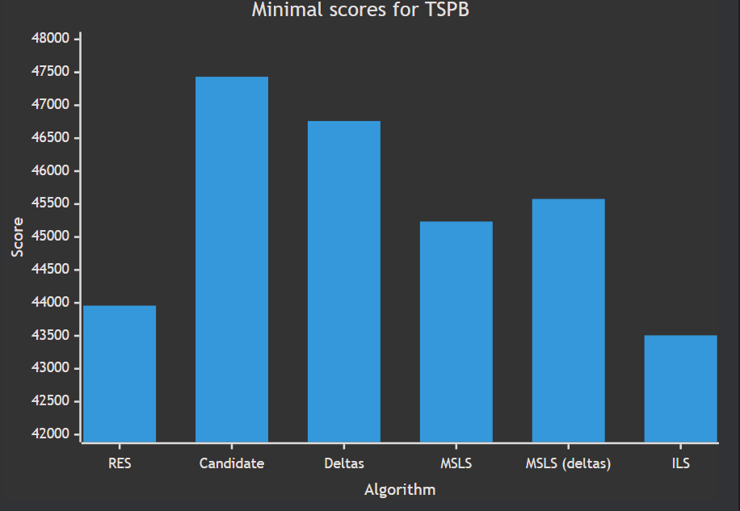

# Assignment 6 - Multiple Start Local Search and Iterated Local Search


## Authors
- Michał Kamiński 151969
- Jan Indrzejczak 152059


# Description of the problem

The travelling salesman problem (TSP) is a classic optimization problem. Given a list of cities and the distances between them, the task is to find the shortest possible route that visits each city exactly once and returns to the origin city. In this version of the problem, each city also has a cost of being visited, and we only need to select half of the cities.

As an input we received a list of coordinates of cities, along with the cost. To calculate the distance between cities we used Euclidean distance, and each city is represented as a number from 0 to n-1 (n-number of cities). The objective function is to find the route that minimizes the sum of distances between cities and the cost of visiting them.

# Pseudocode of all implemented algorithms

## Multiple Start Local Search
```
1. Initialize Variables
Best solution = empty
Best score = infinity

2. Repeat 200 times:
   Generate starting solution
   Run local search (either steepest or steepest with the use of deltas) 
   Evaluate the solution 
   Store the best solution and scores if it is better

3. Return the best solution
```

## Iterated Local Search
```
1. Generate initial solution 
2. Apply local search (steepest with the use of deltas)
3. Repeat until time limit has been reached:
    Perturb the solution
    Apply local search (steepest with the use of deltas)
    If the new solution is better than the current one, replace it
    
4. Retrun the solution

Perturbation:

1. Repeat 20 times:
    Randomly select move type (Intra or Inter)
    Radomly select move parameters
    Apply the move
 2. Return the perturbed solution
```


# Table of the results


| Algorithm                                                                | TSPA                | TSPB                |
|--------------------------------------------------------------------------|---------------------|---------------------|
| Random Start Two Nodes Intra Greedy                                      | 86727 (82039-95867) | 61477 (53396-67230) |
| Random Start Two Edges Intra Greedy                                      | 74035 (77907-82039) | 48390 (45665-51760) |
| Greedy Start Two Nodes Intra Greedy                                      | 71599 (70602-72778) | 45331 (43826-51911) |
| Greedy Start Two Edges Intra Greedy                                      | 71335 (70004-72452) | 44898 (43790-50892) |
| Random Start Two Nodes Intra Steepest                                    | 88618 (81178-98102) | 63387 (56112-73195) |
| Greedy Start Two Nodes Intra Steepest                                    | 71936 (71041-73353) | 45355 (43862-51147) |
| Greedy Start Two Edges Intra Steepest                                    | 71677 (70397-72984) | 45008 (43958-50901) |
| Random Start Two Edges Intra Steepest Candidate                          | 79763 (74876-84144) | 51500 (47433-58226) |
| Random Start Two Edges Intra Steepest                                    | 75326 (72938-80126) | 49725 (46957-52832) |
| Random Start Two Edges Intra Steepest Deltas                             | 74207 (71342-78723) | 49160 (46761-52674) |
| Random Start Two Edges Intra Steepest Multiple Start Local Search        | 71299 (70817-71812) | 45970 (45235-46595) |
| Random Start Two Edges Intra Steepest Deltas Multiple Start Local Search | 71700 (70758-72325) | 46101 (45578-46676) |
| Random Start Two Edges Intra Steepest Deltas Iterated Local Search       | 69340 (69122-69531) | 43647 (43507-43877) |






## Results of previous algorithms

| Algorithm                                        | TSPA                        | TSPB                       |
|--------------------------------------------------|-----------------------------|----------------------------|
| Random Algorithm                                 | 225467                      | 193417                     |
| Nearest Neighbor (Add at End)                    | 83182                       | 52319                      |
| Nearest Neighbor (Insert Anywhere)               | 71179                       | 44417                      |
| Greedy Cycle                                     | 72636 (71488-74410)         | 51401 (49001-57324)        |
| Greedy Regret Heuristic with 2-Regret            | 116681 (108804-123447)      | 70265 (65043-76325)        |
| Greedy Regret Heuristic with Weighted 2-Regret   | 72148 (71108-73718)         | 50997 (47144-56747)        |
| Random Start Two Edges Intra Steepest Candidate  | 79763 (74876-84144)         | 51500 (47433-58226)        |
| Random Start Two Edges Intra Steepest            | 75172 (72784-80372)         | 49635 (47325-52654)        |


# Table of execution times in microseconds (μs)

| Algorithm                                                                | TSPA    | TSPB    |
|--------------------------------------------------------------------------|---------|---------|
| Random Start Two Nodes Intra Greedy                                      | 7634    | 7254    |
| Random Start Two Edges Intra Greedy                                      | 5436    | 5166    |
| Greedy Start Two Nodes Intra Greedy                                      | 13122   | 12566   |
| Greedy Start Two Edges Intra Greedy                                      | 13836   | 12623   |
| Random Start Two Nodes Intra Steepest                                    | 27127   | 28967   |
| Greedy Start Two Nodes Intra Steepest                                    | 12350   | 12597   |
| Greedy Start Two Edges Intra Steepest                                    | 12498   | 12690   |
| Random Start Two Edges Intra Steepest Candidate                          | 9225    | 9826    |
| Random Start Two Edges Intra Steepest                                    | 18214   | 18860   |
| Random Start Two Edges Intra Steepest Deltas                             | 8818    | 9259    |
| Random Start Two Edges Intra Steepest Multiple Start Local Search        | 6573463 | 6539911 |
| Random Start Two Edges Intra Steepest Deltas Multiple Start Local Search | 2182366 | 2067664 |
| Random Start Two Edges Intra Steepest Deltas Iterated Local Search       | 2001405 | 2001686 |


# Table of number of local search iterations

| Algorithm                                                                | Iterations |
|--------------------------------------------------------------------------|------------|
| Random Start Two Edges Intra Steepest Multiple Start Local Search        | 200        |
| Random Start Two Edges Intra Steepest Deltas Multiple Start Local Search | 200        |
| Random Start Two Edges Intra Steepest Deltas Iterated Local Search       | 382        |

# Raw results

## TSPA 
```

Results for Random Start Two Edges Intra Steepest Multiple Start Local Search
Min cost: 70817
Max cost: 71812
Average cost: 71299

Time took for 20 runs: 131.46927050s, time per run: 6573463μs

Best solution:
[151, 162, 133, 180, 53, 154, 135, 70, 127, 123, 149, 65, 116, 59, 115, 46, 68, 139, 41, 193, 159, 42, 43, 184, 35, 84, 112, 4, 190, 10, 177, 30, 54, 48, 160, 34, 22, 18, 108, 93, 117, 0, 143, 183, 89,
 23, 137, 186, 15, 148, 9, 62, 102, 49, 14, 144, 21, 7, 164, 27, 90, 81, 196, 40, 119, 165, 185, 106, 178, 52, 55, 57, 92, 145, 78, 31, 113, 175, 171, 16, 25, 44, 120, 129, 2, 152, 97, 1, 101, 75, 86, 100, 26, 124, 94, 63, 79, 80, 176, 51]

Results for Random Start Two Edges Intra Steepest Deltas Multiple Start Local Search
Min cost: 70758
Max cost: 72325
Average cost: 71700

Time took for 20 runs: 43.64732230s, time per run: 2182366μs

Best solution:
[22, 18, 159, 193, 41, 139, 115, 46, 68, 117, 0, 143, 183, 89, 186, 23, 137, 176, 80, 133, 79, 122, 63, 94, 124, 148, 9, 62, 102, 49, 144, 14, 138, 3, 178, 106, 185, 40, 119, 165, 39, 27, 90, 81, 196, 
179, 52, 55, 57, 92, 129, 82, 78, 145, 31, 56, 113, 175, 171, 16, 25, 44, 120, 2, 152, 97, 1, 101, 75, 86, 26, 100, 121, 53, 158, 180, 154, 135, 70, 127, 123, 162, 151, 51, 118, 59, 65, 116, 43, 42, 184, 84, 112, 4, 177, 54, 48, 160, 34, 146]

Results for Random Start Two Edges Intra Steepest Deltas Iterated Local Search
Min cost: 69122
Max cost: 69531
Average cost: 69340

Time took for 20 runs: 40.02811420s, time per run: 2001405μs

Best solution:
[151, 51, 118, 59, 115, 46, 68, 139, 41, 193, 159, 181, 42, 43, 116, 65, 149, 131, 184, 84, 112, 4, 190, 10, 177, 54, 48, 160, 34, 146, 22, 18, 108, 140, 93, 117, 0, 143, 183, 89, 186, 23, 137, 176, 80, 79, 63, 94, 124, 148, 9, 62, 102, 144, 14, 49, 178, 106, 52, 55, 57, 129, 92, 78, 145, 179, 185, 40, 119, 165, 90, 81, 196, 31, 56, 113, 175, 171, 16, 25, 44, 120, 2, 152, 97, 1, 101, 75, 86, 26, 100, 53, 180, 154, 135, 70, 127, 123, 162, 133]

```

## TSPB
```

Results for Random Start Two Edges Intra Steepest Multiple Start Local Search
Min cost: 45235
Max cost: 46595
Average cost: 45970

Time took for 20 runs: 130.79823430s, time per run: 6539911μs

Best solution:
[124, 106, 143, 111, 82, 87, 21, 8, 56, 104, 138, 139, 11, 33, 160, 144, 0, 35, 109, 29, 168, 195, 13, 145, 15, 3, 70, 132, 169, 188, 6, 147, 191, 90, 125, 51, 121, 131, 135, 122, 133, 107, 40, 100, 63
, 38, 27, 1, 156, 198, 117, 54, 73, 31, 193, 190, 80, 175, 78, 5, 177, 36, 61, 91, 141, 97, 77, 81, 153, 163, 89, 165, 127, 103, 113, 180, 176, 194, 166, 86, 95, 130, 99, 185, 179, 94, 47, 148, 20, 28, 149, 4, 199, 140, 183, 152, 34, 55, 18, 62]

Results for Random Start Two Edges Intra Steepest Deltas Multiple Start Local Search
Min cost: 45578
Max cost: 46676
Average cost: 46101

Time took for 20 runs: 41.35328490s, time per run: 2067664μs

Best solution:
[11, 138, 33, 160, 144, 56, 104, 8, 21, 82, 111, 29, 0, 109, 35, 143, 106, 124, 62, 18, 55, 34, 170, 152, 183, 140, 4, 149, 28, 20, 60, 148, 47, 94, 66, 179, 185, 130, 95, 86, 166, 194, 176, 180, 113, 
103, 89, 127, 163, 153, 77, 97, 141, 61, 36, 177, 5, 175, 45, 190, 80, 73, 54, 31, 193, 117, 198, 156, 1, 16, 27, 38, 102, 63, 135, 122, 100, 40, 107, 133, 10, 147, 90, 121, 51, 134, 6, 188, 65, 169, 132, 70, 3, 15, 145, 13, 195, 168, 43, 139]

Results for Random Start Two Edges Intra Steepest Deltas Iterated Local Search
Min cost: 43507
Max cost: 43877
Average cost: 43647

Time took for 20 runs: 40.03373060s, time per run: 2001686μs

Best solution:
[55, 18, 62, 124, 106, 143, 35, 109, 0, 29, 111, 82, 21, 8, 104, 144, 160, 33, 138, 11, 139, 168, 195, 13, 145, 15, 3, 70, 132, 169, 188, 6, 147, 10, 133, 107, 40, 63, 135, 122, 90, 51, 121, 131, 1, 15
6, 198, 117, 193, 31, 54, 73, 136, 190, 80, 45, 142, 175, 78, 5, 177, 36, 61, 91, 141, 77, 81, 153, 163, 103, 89, 127, 137, 114, 113, 180, 176, 194, 166, 86, 185, 95, 130, 99, 22, 179, 66, 94, 47, 148, 60, 20, 28, 149, 4, 140, 183, 152, 170, 34]

```

# Plots of the results

## TSPA


## TSPB


# Source code

- [Github repository](https://github.com/2002jan/put-ec-2024)


# Conclusions
All implemented methods performed better than the previous ones. Multiple Start Local search with the use of Local Search with deltas always improved the solution and time execution. Time per run was around 2 seconds,
thus this was also the limit for Iterated Local Search. ILS consistently outperformed MSLS. As the perturbation function we used simple stacking of 20 random moves. The number of moves was tested experimentally and this gave the best results. 
