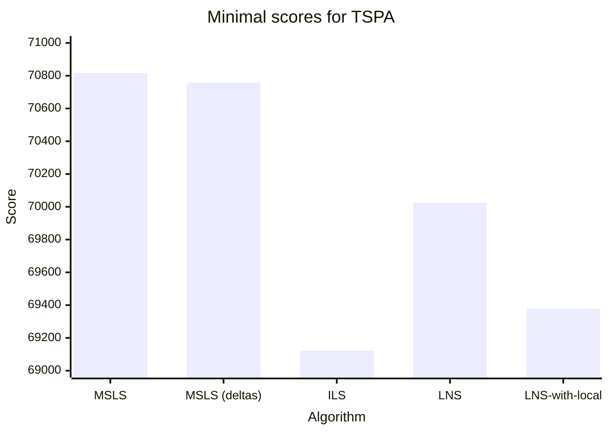
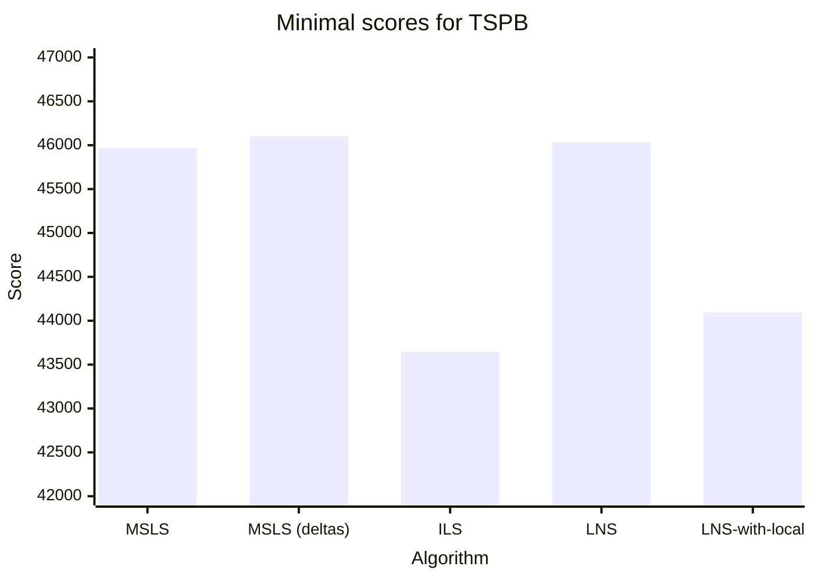

# Assignment 7 - Large-scale neighborhood search


## Authors
- Michał Kamiński 151969
- Jan Indrzejczak 152059


# Description of the problem

The travelling salesman problem (TSP) is a classic optimization problem. Given a list of cities and the distances between them, the task is to find the shortest possible route that visits each city exactly once and returns to the origin city. In this version of the problem, each city also has a cost of being visited, and we only need to select half of the cities.

As an input we received a list of coordinates of cities, along with the cost. To calculate the distance between cities we used Euclidean distance, and each city is represented as a number from 0 to n-1 (n-number of cities). The objective function is to find the route that minimizes the sum of distances between cities and the cost of visiting them.

# Pseudocode of all implemented algorithms

## Destroy method

```
Calculate the number of nodes to remove as a fixed percentage of the solution size.
Randomly select nodes to be removed from the solution.
Repeat the removal process until the desired portion of the solution has been destroyed.
```

## Large-scale neighborhood search (LNS)

```
Initialization:
    Generate a random starting solution
    Perform Steepest Local Serch with the use of deltas on the solution
    Store the evaluation of the solution
    
Iterative improvement:
    Repeat until the runtime interval is exceeded (2 seconds):
        Destroy Step: Partially destroy the current best solution using a predefined destruction method
        Repair Step: Rebuild the solution using a predefined greedy heuristic
    Calculate the cost of the locally optimized solution.
    If the new solution's cost is better than the current best cost:
        Store the new solution as the best solution
  
Return the best solution found during the runtime
```

## Large-scale neighborhood search with local search (LNSw)

```
Initialization:
    Generate a random starting solution
    Perform Steepest Local Serch with the use of deltas on the solution
    Store the evaluation of the solution
    
Iterative improvement:
    Repeat until the runtime interval is exceeded (2 seconds):
        Destroy Step: Partially destroy the current best solution using a predefined destruction method
        Repair Step: Rebuild the solution using a predefined greedy heuristic
        Perform Steepest Local Serch with the use of deltas on the solution
    Calculate the cost of the locally optimized solution.
    If the new solution's cost is better than the current best cost:
        Store the new solution as the best solution
  
Return the best solution found during the runtime
```

# Table of the results


| Algorithm                                                                | TSPA                | TSPB                |
|--------------------------------------------------------------------------|---------------------|---------------------|
| Random Start Two Edges Intra Steepest Deltas                             | 74207 (71342-78723) | 49160 (46761-52674) |
| Random Start Two Edges Intra Steepest Multiple Start Local Search        | 71299 (70817-71812) | 45970 (45235-46595) |
| Random Start Two Edges Intra Steepest Deltas Multiple Start Local Search | 71700 (70758-72325) | 46101 (45578-46676) |
| Random Start Two Edges Intra Steepest Deltas Iterated Local Search       | 69340 (69122-69531) | 43647 (43507-43877) |
| Greedy Regret Heuristic with weighted 2-Regret Random Destroy LNS        | 70987 (70024-72625) | 46034 (44398-48968) |
| Greedy Regret Heuristic with weighted 2-Regret Random Destroy LNSw       | 69720 (69378-70168) | 44095 (43509-44602) |






## Results of previous algorithms

| Algorithm                                       | TSPA                   | TSPB                |
|-------------------------------------------------|------------------------|---------------------|
| Random Algorithm                                | 225467                 | 193417              |
| Nearest Neighbor (Add at End)                   | 83182                  | 52319               |
| Nearest Neighbor (Insert Anywhere)              | 71179                  | 44417               |
| Greedy Cycle                                    | 72636 (71488-74410)    | 51401 (49001-57324) |
| Greedy Regret Heuristic with 2-Regret           | 116681 (108804-123447) | 70265 (65043-76325) |
| Greedy Regret Heuristic with Weighted 2-Regret  | 72148 (71108-73718)    | 50997 (47144-56747) |
| Random Start Two Edges Intra Steepest Candidate | 79763 (74876-84144)    | 51500 (47433-58226) |
| Random Start Two Edges Intra Steepest           | 75172 (72784-80372)    | 49635 (47325-52654) |
| Random Start Two Nodes Intra Greedy             | 86727 (82039-95867)    | 61477 (53396-67230) |
| Random Start Two Edges Intra Greedy             | 74035 (77907-82039)    | 48390 (45665-51760) |
| Greedy Start Two Nodes Intra Greedy             | 71599 (70602-72778)    | 45331 (43826-51911) |
| Greedy Start Two Edges Intra Greedy             | 71335 (70004-72452)    | 44898 (43790-50892) |
| Random Start Two Nodes Intra Steepest           | 88618 (81178-98102)    | 63387 (56112-73195) |
| Greedy Start Two Nodes Intra Steepest           | 71936 (71041-73353)    | 45355 (43862-51147) |
| Greedy Start Two Edges Intra Steepest           | 71677 (70397-72984)    | 45008 (43958-50901) |
| Random Start Two Edges Intra Steepest Candidate | 79763 (74876-84144)    | 51500 (47433-58226) |
| Random Start Two Edges Intra Steepest           | 75326 (72938-80126)    | 49725 (46957-52832) |

# Table of average number of main loop iterations

| Algorithm                                                                | Iterations |
|--------------------------------------------------------------------------|------------|
| Greedy Regret Heuristic with weighted 2-Regret Random Destroy LNS        | 1183       |
| Greedy Regret Heuristic with weighted 2-Regret Random Destroy LNSw       | 846        |
| Random Start Two Edges Intra Steepest Multiple Start Local Search        | 200        |
| Random Start Two Edges Intra Steepest Deltas Multiple Start Local Search | 200        |
| Random Start Two Edges Intra Steepest Deltas Iterated Local Search       | 382        |
# Raw results 

## TSPA

```
Results for Greedy Regret Heuristic with weighted 2-Regret Random Destroy LNS
Min cost: 70024
Max cost: 72625
Average cost: 70987

Time took for 20 runs: 40.02692720s, time per run: 2001346μs

Best solution:
[9, 62, 144, 14, 49, 178, 106, 52, 55, 57, 92, 120, 44, 25, 16, 171, 175, 113, 56, 31, 157, 196, 81, 90, 165, 40, 185, 179, 145, 78, 129, 2, 152, 97, 1, 101, 75, 86, 26, 100, 121, 53, 180, 154, 135, 70, 127, 123, 112, 4, 190, 10, 177, 54, 48, 160, 184, 35, 131, 149, 162, 151, 133, 79, 63, 94, 80, 176, 51, 118, 59, 65, 116, 43, 42, 181, 34, 146, 22, 18, 108, 69, 159, 193, 41, 139, 115, 46, 68, 140, 93, 117, 0, 143, 183, 89, 186, 23, 137, 148]

Results for Greedy Regret Heuristic with weighted 2-Regret Random Destroy LNSw
Min cost: 69378
Max cost: 70168
Average cost: 69720

Time took for 20 runs: 40.01948960s, time per run: 2000974μs

Best solution:
[112, 4, 190, 10, 177, 54, 48, 160, 34, 181, 146, 22, 18, 108, 69, 159, 193, 41, 139, 115, 46, 68, 140, 93, 117, 0, 143, 183, 89, 23, 137, 186, 114, 15, 144, 14, 49, 102, 62, 9, 148, 124, 94, 152, 2, 129, 92, 57, 55, 52, 178, 106, 185, 40, 165, 90, 81, 196, 179, 145, 78, 31, 56, 113, 175, 171, 16, 25, 44, 120, 75, 86, 101, 1, 97, 26, 100, 53, 180, 154, 135, 70, 127, 123, 162, 151, 133, 79, 63, 80, 176, 51, 118, 59, 65, 116, 43, 42, 184, 84]

```

## TSPB

```
Results for Greedy Regret Heuristic with weighted 2-Regret Random Destroy LNS
Min cost: 44398
Max cost: 48968
Average cost: 46034

Time took for 20 runs: 40.02403590s, time per run: 2001201μs

Best solution:
[113, 103, 127, 89, 163, 187, 153, 81, 35, 109, 0, 29, 160, 33, 138, 11, 139, 43, 168, 195, 13, 145, 15, 3, 70, 132, 169, 188, 6, 147, 90, 51, 121, 131, 135, 122, 133, 107, 40, 63, 38, 27, 16, 1, 156, 198, 117, 193, 31, 54, 73, 136, 190, 80, 162, 175, 78, 5, 177, 36, 61, 91, 141, 77, 82, 21, 8, 111, 143, 106, 124, 62, 18, 55, 34, 170, 152, 183, 140, 4, 149, 28, 20, 60, 148, 47, 94, 66, 57, 172, 179, 22, 99, 130, 95, 185, 86, 166, 194, 176]

Results for Greedy Regret Heuristic with weighted 2-Regret Random Destroy LNSw
Min cost: 43509
Max cost: 44602
Average cost: 44095

Time took for 20 runs: 40.03672420s, time per run: 2001836μs

Best solution:
[194, 176, 113, 114, 137, 127, 89, 103, 163, 187, 153, 81, 77, 141, 91, 61, 36, 177, 5, 78, 175, 142, 45, 162, 80, 190, 136, 73, 54, 31, 193, 117, 198, 156, 1, 131, 121, 51, 90, 122, 135, 63, 40, 107, 133, 10, 147, 6, 188, 169, 132, 70, 3, 15, 145, 13, 195, 168, 139, 11, 138, 33, 160, 144, 104, 8, 82, 111, 29, 0, 109, 35, 143, 106, 124, 62, 18, 55, 34, 170, 152, 183, 140, 4, 149, 28, 20, 60, 148, 47, 94, 66, 179, 22, 99, 130, 95, 185, 86, 166]
```

# Plots of the results

## TSPA


## TSPB


# Source code

- [Github repository](https://github.com/2002jan/put-ec-2024)

# Conclusions
The large-scale neighborhood search performed better than Multiple Start Local Search, however it was worse
than Iterated Local Search. The version of LNS with both local searches present performed better than the version without. 
Interestingly, removing both local searches resulted in a worse performance - it could be seen that the graph had crossing edges. In the time bounded by MSLS runtime, 
this algorithm could not "untangle" the solution. Unsurprisingly, the average number of iterations for LNSw was lower than LNS without local searches. 