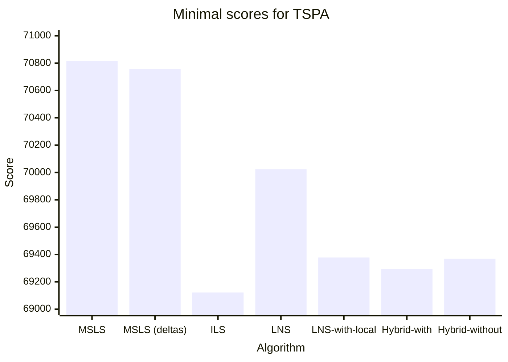
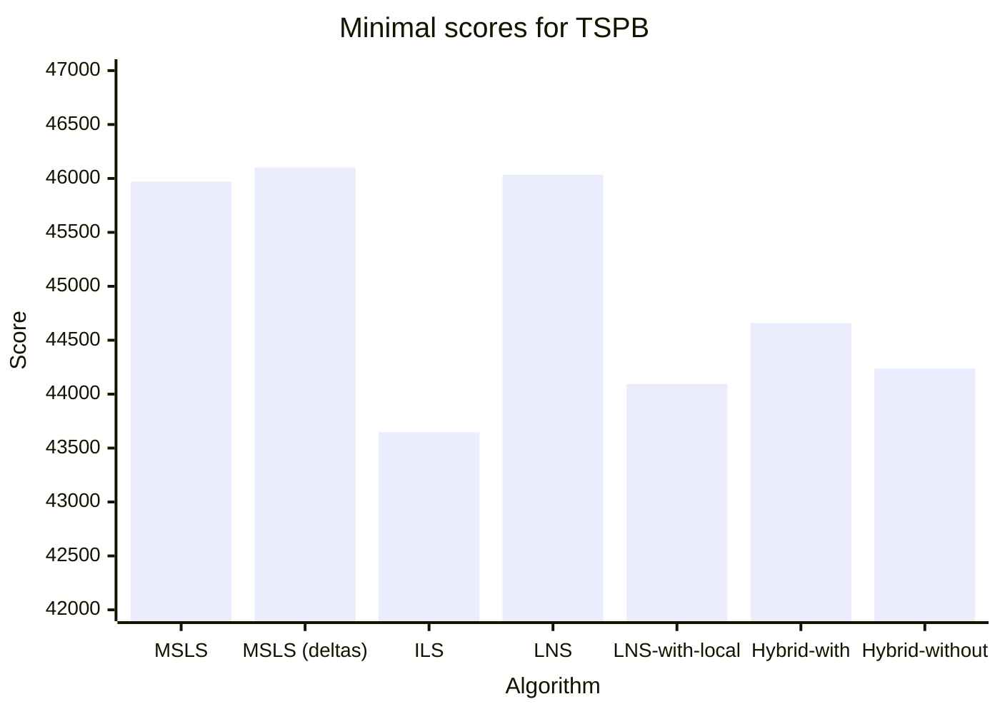

# Assignment 9 - Hybrid evolutionary algorithm


## Authors
- Michał Kamiński 151969
- Jan Indrzejczak 152059


# Description of the problem

The travelling salesman problem (TSP) is a classic optimization problem. Given a list of cities and the distances between them, the task is to find the shortest possible route that visits each city exactly once and returns to the origin city. In this version of the problem, each city also has a cost of being visited, and we only need to select half of the cities.

As an input we received a list of coordinates of cities, along with the cost. To calculate the distance between cities we used Euclidean distance, and each city is represented as a number from 0 to n-1 (n-number of cities). The objective function is to find the route that minimizes the sum of distances between cities and the cost of visiting them.

# Pseudocode of all implemented algorithms

## Hybrid evolutionary algorithm

```
Function RunHybridEvolutionary
    Initialize the starting population of 20 individuals (Random starting solution with SteepestDeltasLocalSearch run on each)
    Evaluate each individual in the population
    Sort the population by the fitness
    
    Until the running time is exceeded:
        Choose parent1 and parent2 from the population at random
        Perform crossover on parent1 and parent2 to create a child
        Perform mutation on the child
        Either run SteepestDeltasLocalSearch on the child or proceed without LS
        If the child already exists in the population go back to the beginning of the loop        
        Add the child ot the population, sort it and truncate to keep the best 20 individuals
     
    Return the best individual from the population
        
```

## Mutation operator

```
Function Mutate
    Choose a random node from the individual to be replaced
    Choose a random node from the remaining nodes to replace it with
    Replace the nodes
    Return the mutated individual
```

## Crossover operator

```

```

# Table of the results


| Algorithm                                                                | TSPA                | TSPB                |
|--------------------------------------------------------------------------|---------------------|---------------------|
| Random Start Two Edges Intra Steepest Deltas                             | 74207 (71342-78723) | 49160 (46761-52674) |
| Random Start Two Edges Intra Steepest Multiple Start Local Search        | 71299 (70817-71812) | 45970 (45235-46595) |
| Random Start Two Edges Intra Steepest Deltas Multiple Start Local Search | 71700 (70758-72325) | 46101 (45578-46676) |
| Random Start Two Edges Intra Steepest Deltas Iterated Local Search       | 69340 (69122-69531) | 43647 (43507-43877) |
| Greedy Regret Heuristic with weighted 2-Regret Random Destroy LNS        | 70987 (70024-72625) | 46034 (44398-48968) |
| Greedy Regret Heuristic with weighted 2-Regret Random Destroy LNSw       | 69720 (69378-70168) | 44095 (43509-44602) |
| Hybrid Evolutionary Algorithm with LS after recombination                | 69831 (69293-70248) | 45231 (44659-45867) |
| Hybrid Evolutionary Algorithm with without LS after recombination        | 70094 (69369-70618) | 45185 (44236-46196) |




## Results of previous algorithms

| Algorithm                                       | TSPA                   | TSPB                |
|-------------------------------------------------|------------------------|---------------------|
| Random Algorithm                                | 225467                 | 193417              |
| Nearest Neighbor (Add at End)                   | 83182                  | 52319               |
| Nearest Neighbor (Insert Anywhere)              | 71179                  | 44417               |
| Greedy Cycle                                    | 72636 (71488-74410)    | 51401 (49001-57324) |
| Greedy Regret Heuristic with 2-Regret           | 116681 (108804-123447) | 70265 (65043-76325) |
| Greedy Regret Heuristic with Weighted 2-Regret  | 72148 (71108-73718)    | 50997 (47144-56747) |
| Random Start Two Edges Intra Steepest Candidate | 79763 (74876-84144)    | 51500 (47433-58226) |
| Random Start Two Edges Intra Steepest           | 75172 (72784-80372)    | 49635 (47325-52654) |
| Random Start Two Nodes Intra Greedy             | 86727 (82039-95867)    | 61477 (53396-67230) |
| Random Start Two Edges Intra Greedy             | 74035 (77907-82039)    | 48390 (45665-51760) |
| Greedy Start Two Nodes Intra Greedy             | 71599 (70602-72778)    | 45331 (43826-51911) |
| Greedy Start Two Edges Intra Greedy             | 71335 (70004-72452)    | 44898 (43790-50892) |
| Random Start Two Nodes Intra Steepest           | 88618 (81178-98102)    | 63387 (56112-73195) |
| Greedy Start Two Nodes Intra Steepest           | 71936 (71041-73353)    | 45355 (43862-51147) |
| Greedy Start Two Edges Intra Steepest           | 71677 (70397-72984)    | 45008 (43958-50901) |
| Random Start Two Edges Intra Steepest Candidate | 79763 (74876-84144)    | 51500 (47433-58226) |
| Random Start Two Edges Intra Steepest           | 75326 (72938-80126)    | 49725 (46957-52832) |

# Raw results

## TSPA

```
Results for Steepest Deltas Random Replace Mutation Keep Common Fill LS Crossover with Greedy Regret Heuristic with weighted 2-Regret Hybrid Evolutionary algorithm
Min cost: 69293
Max cost: 70248
Average cost: 69831

Time took for 20 runs: 40.04714160s, time per run: 2002357μs

Best solution:
[118, 51, 151, 133, 162, 123, 127, 70, 135, 154, 180, 53, 121, 100, 26, 86, 75, 101, 1, 97, 152, 2, 129, 57, 92, 82, 120, 44, 25, 16, 171, 175, 113, 56, 31, 78, 145, 179, 196, 81, 90, 165, 40, 185, 55, 52, 106, 178, 49, 14, 144, 102, 62, 9, 148, 124, 94, 63, 79, 80, 176, 137, 23, 186, 89, 183, 143, 0, 117, 93, 140, 68, 46, 115, 139, 41, 193, 159, 69, 108, 18, 22, 146, 181, 34, 160, 48, 54, 177, 10, 190, 4, 112, 84, 184, 42, 43, 116, 65, 59]

Results for Fake Local Search Random Replace Mutation Keep Common Fill LS Crossover with Greedy Regret Heuristic with weighted 2-Regret Hybrid Evolutionary algorithm
Min cost: 69369
Max cost: 70618
Average cost: 70094

Time took for 20 runs: 40.03158410s, time per run: 2001579μs

Best solution:
[181, 34, 160, 48, 54, 177, 10, 190, 4, 112, 84, 35, 184, 42, 43, 116, 65, 59, 118, 51, 151, 133, 162, 123, 127, 70, 135, 154, 180, 53, 121, 100, 26, 86, 75, 101, 1, 97, 152, 2, 120, 44, 25, 16, 171, 175, 113, 56, 31, 78, 145, 179, 92, 129, 57, 55, 52, 185, 40, 196, 81, 90, 165, 106, 178, 49, 14, 144, 102, 62, 9, 148, 124, 94, 63, 79, 80, 176, 137, 23, 186, 89, 183, 143, 0, 117, 93, 140, 68, 46, 115, 139, 41, 193, 159, 69, 108, 18, 22, 146]

```

## TSPB

```

Results for Steepest Deltas Random Replace Mutation Keep Common Fill LS Crossover with Greedy Regret Heuristic with weighted 2-Regret Hybrid Evolutionary algorithm
Min cost: 44659
Max cost: 45867
Average cost: 45231

Time took for 20 runs: 40.06822370s, time per run: 2003411μs

Best solution:
[38, 27, 16, 1, 24, 156, 198, 117, 193, 31, 54, 73, 136, 190, 80, 45, 175, 78, 5, 177, 25, 104, 8, 111, 82, 21, 61, 36, 91, 141, 77, 81, 153, 187, 163, 89, 127, 103, 113, 176, 194, 166, 86, 95, 130, 99, 185, 179, 172, 57, 66, 94, 47, 148, 60, 20, 59, 28, 149, 4, 140, 183, 152, 170, 34, 55, 18, 62, 124, 106, 143, 35, 109, 0, 29, 160, 33, 138, 11, 139, 43, 168, 195, 145, 15, 3, 70, 13, 132, 169, 188, 6, 147, 90, 51, 121, 131, 122, 135, 63]

Results for Fake Local Search Random Replace Mutation Keep Common Fill LS Crossover with Greedy Regret Heuristic with weighted 2-Regret Hybrid Evolutionary algorithm
Min cost: 44236
Max cost: 46196
Average cost: 45185

Time took for 20 runs: 40.02311780s, time per run: 2001155μs

Best solution:
[28, 149, 4, 140, 183, 152, 170, 34, 55, 18, 62, 128, 124, 106, 143, 35, 109, 0, 29, 160, 33, 138, 11, 139, 43, 168, 195, 145, 15, 3, 70, 13, 132, 169, 188, 6, 147, 71, 51, 121, 131, 90, 122, 133, 107, 40, 63, 135, 38, 27, 16, 1, 156, 198, 117, 193, 54, 31, 73, 136, 190, 80, 162, 175, 78, 5, 177, 104, 8, 82, 21, 36, 61, 91, 141, 77, 81, 153, 187, 163, 89, 127, 103, 113, 176, 194, 166, 86, 185, 95, 130, 99, 22, 179, 66, 94, 47, 148, 60, 20]


```


# Plots of the results 

## TSPA


## TSPB


# Source code

- [Github repository](https://github.com/2002jan/put-ec-2024)

# Conclusions


